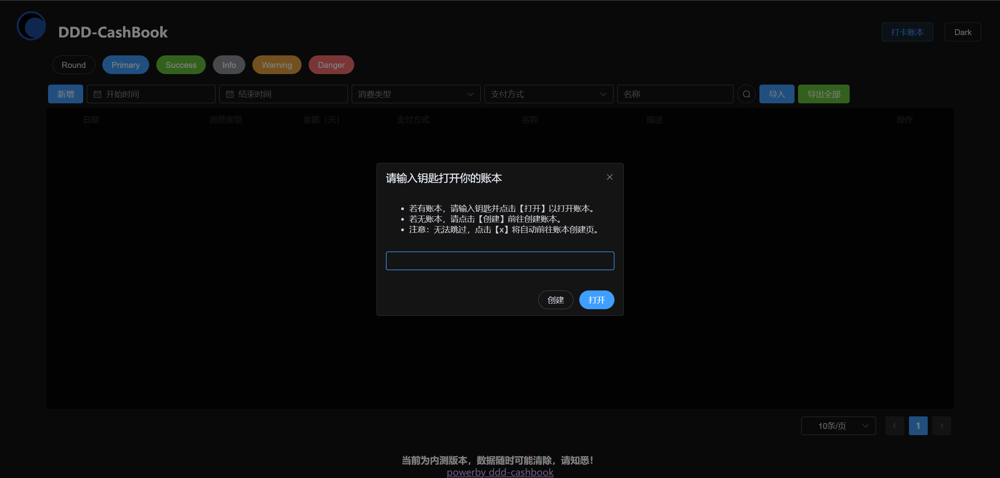
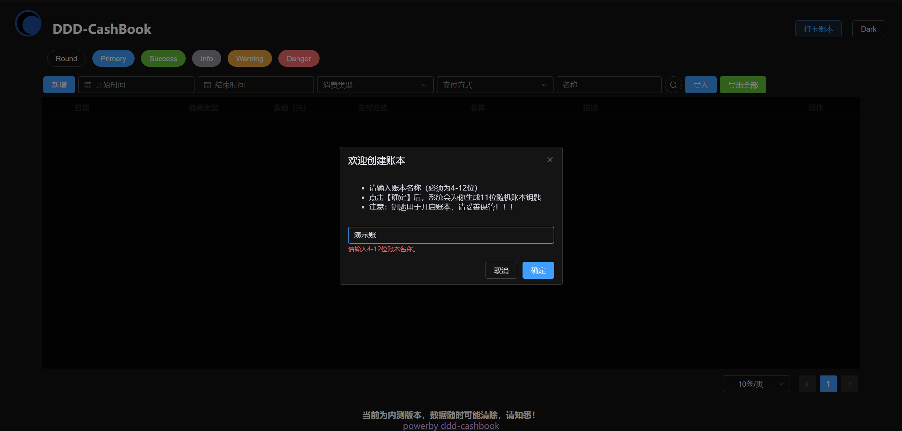
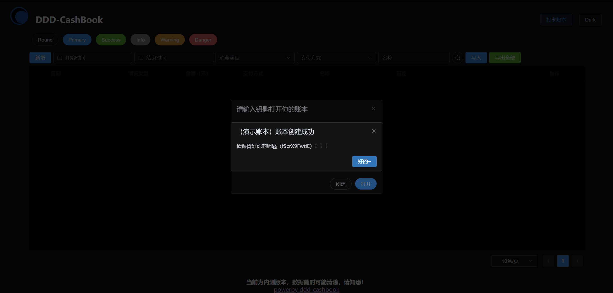
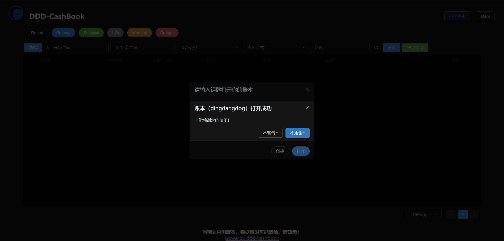
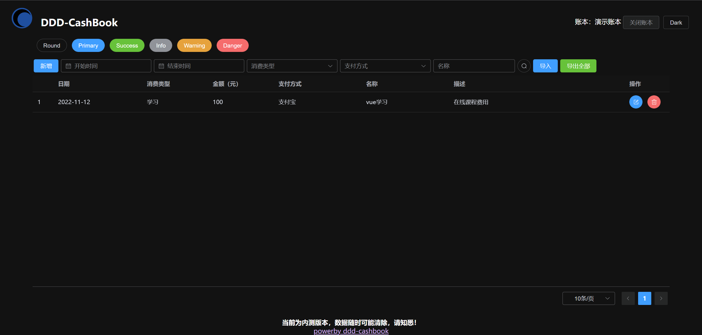
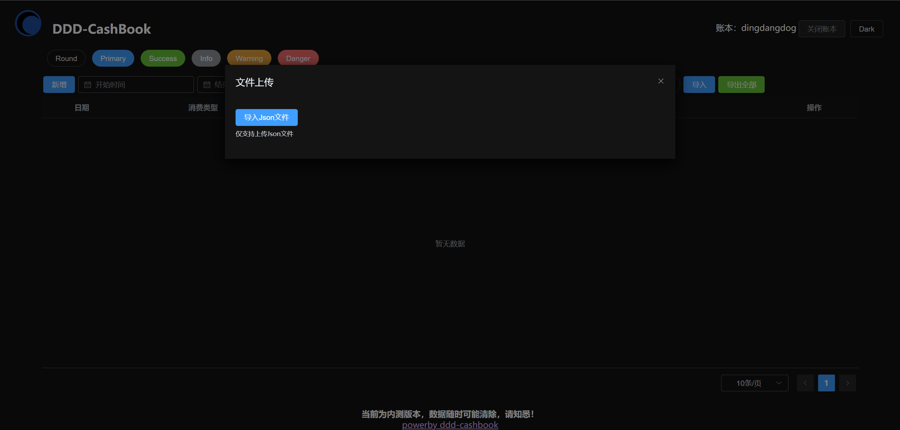
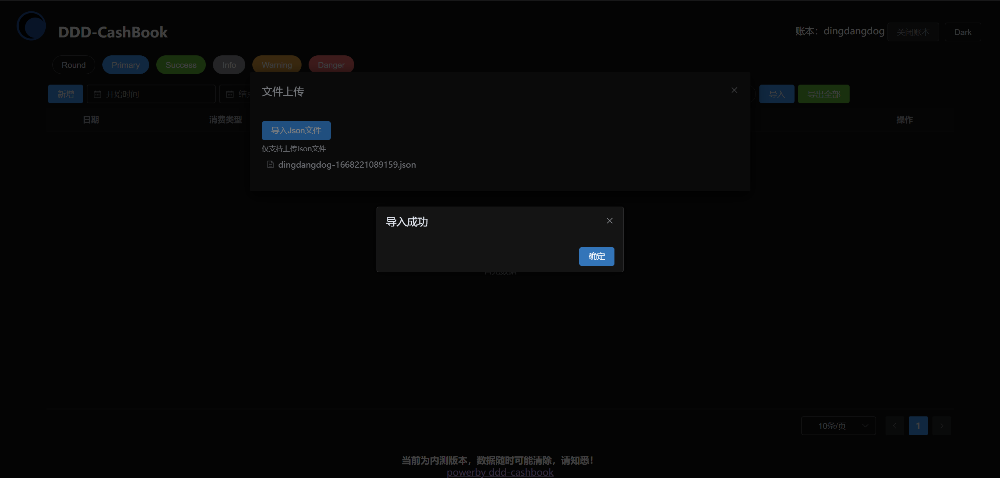
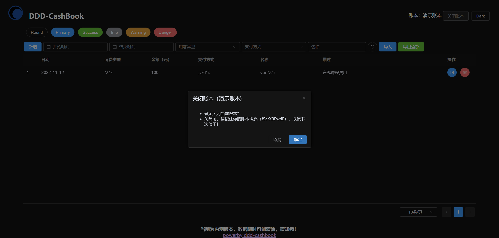
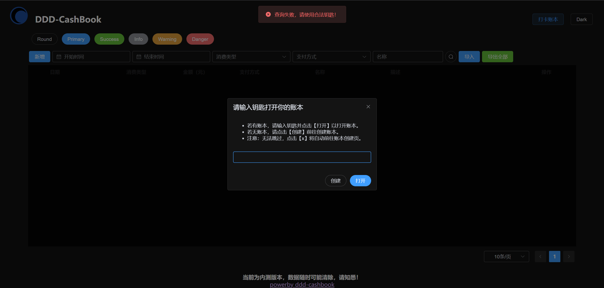

<h1>ddd-cashbook</h1>

DDD记账本

  
  
  
  

## 概念说明

- **账本**：本系统的用户级概念，必须打开（登录）账本才能记录、查看流水。
- **钥匙**：每个账本的密码，用于打开账本。
- **流水**：每一笔支出记录即是一个流水。

## 主要功能

### 基本功能

- [x]  新增账本
- [x]  记录流水（增删改查）
- [x]  导入导出流水

### 拓展功能

- [ ]  主题切换：黑/白
- [ ]  流水统计图表
- [ ]  流水趋势曲线
- [ ]  流水分类统计

## 演示系统

- 请以PC端打开，目前未适配其他终端。

- 演示账本钥匙：`fScrX9FwtiE`

## 私有部署

### Windows

- [ ] TODO

### Linux

- [ ] TODO

### Docker

- [ ] TODO

## 截图展示

### 前置说明

- 按照使用流程进行截图；
- 以下为最新截图，后续可能会有变化；

### 打开系统

### 创建账本

### 打开账本

### 新增流水

### 修改删除

- 修改删除均只能针对单条流水，在每条流水的操作列，很简单，暂不截图。

### 导入导出

#### 导入

#### 导出

- 导出当前账本的全部流水

### 关闭账本

- 关闭成功，自动重新加载

