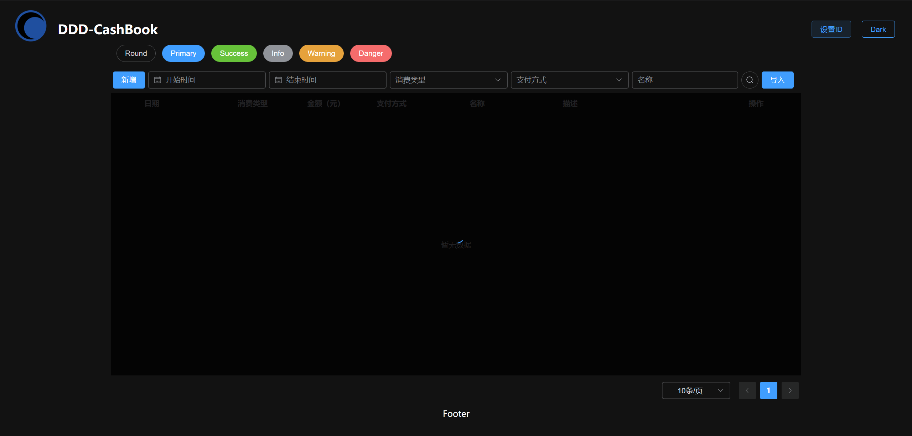
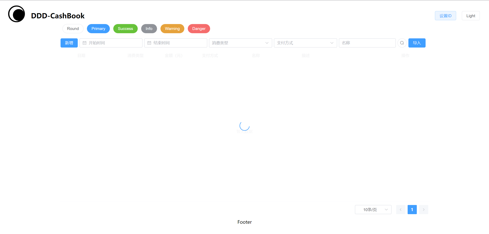
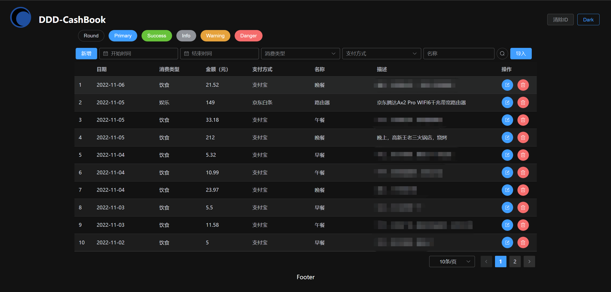
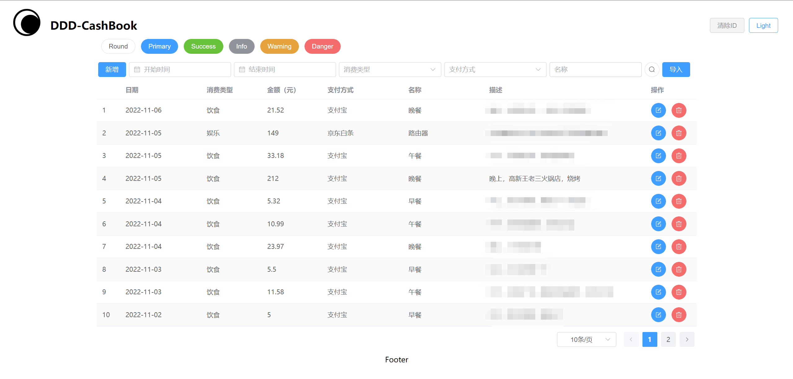
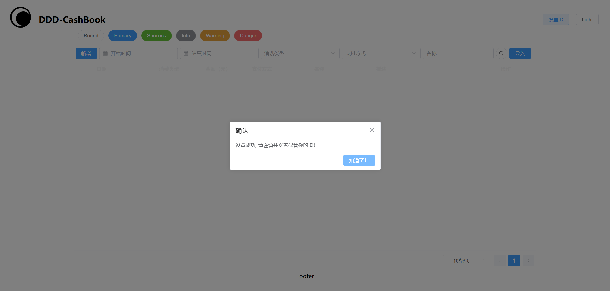
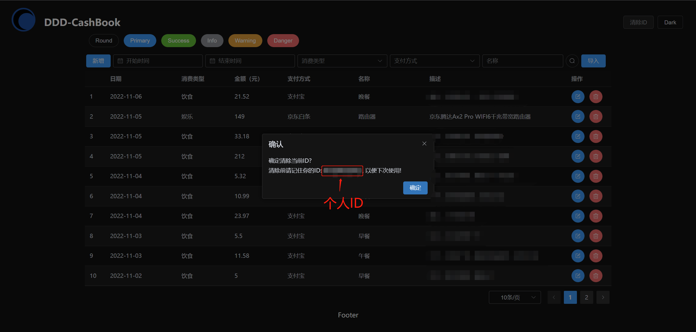
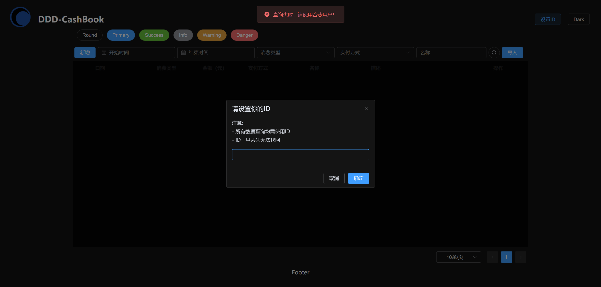

# ddd-cashbook
DDD记账本

## 主要功能

- 流水账的增删改查

## 截图展示

### 前置说明

- 本系统无登录功能，只有当前用户ID的设置，为便于理解，下方将未设置ID时称为`未登录状态`，已设置ID时称为`登录状态`。
- 当前基础功能开发完毕的截图，后续增加新功能，页面会有变化

### 未登录状态

- 暗色

- 亮色

### 登录状态

- 暗色

- 亮色

### 设置ID

- 未登录状态下，点击右上角`设置ID`按钮，弹出设置弹窗

- 设置后，弹出提示框，关闭后弹窗，页面会刷新并重新加载数据。

- 取消后，会弹出系统不可用提示框

### 清除ID

- 已登录状态下，点击右上角`清除ID`按钮，弹出确认框。

- 确定后，会清除ID并重新加载页面。并自动弹出设置ID的窗口

